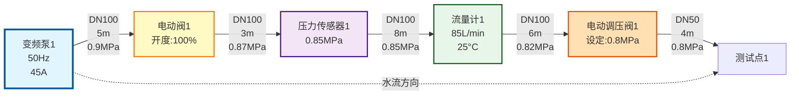
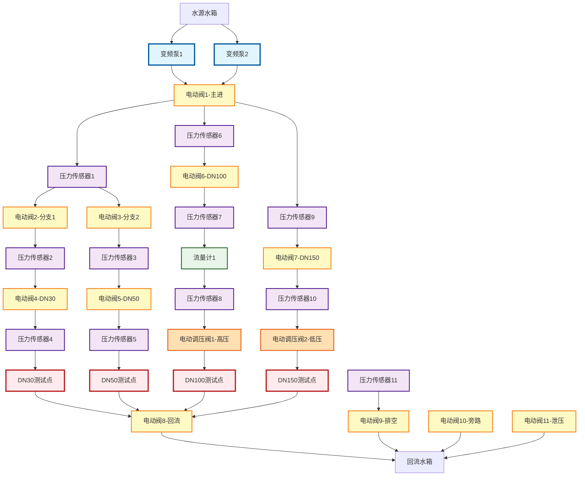

# 水压检测系统 - 物理管路流程图

## 系统概览

这是水介质在物理管路中的实际流动路径，展示了从变频泵驱动到测试点的完整过程。

## 主测试回路流程



## 完整系统拓扑



## 设备分布统计

| 设备类型 | 数量 | 作用 |
|---------|------|------|
| 变频泵 | 2 | 提供动力和流量 |
| 电动阀 | 11 | 控制水流方向和通断 |
| 压力传感器 | 11 | 监测各点压力 |
| 流量计 | 1 | 测量流量和温度 |
| 电动调压阀 | 2 | 精确调节压力 |

## 典型测试流程

### DN100管路测试流程

```
1. 启动阶段
   变频泵1启动 → 30Hz → 逐渐升至50Hz
   ↓
2. 管路充水
   电动阀1打开(主进) → 电动阀6打开(DN100支路)
   ↓
3. 压力建立
   压力传感器6检测 → 压力传感器7检测 → 压力传感器8检测
   ↓
4. 流量稳定
   流量计1监测 → 达到目标流量(85L/min)
   ↓
5. 压力调节
   电动调压阀1工作 → 设定压力0.8MPa → 实际压力稳定在0.8±0.02MPa
   ↓
6. 数据采集
   持续记录: 流量、压力、温度 → 1秒1次 → 持续60秒
   ↓
7. 测试结束
   电动调压阀1回零 → 电动阀6关闭 → 变频泵1降速 → 停止
```

## 水流状态监控

### 实时参数显示

```
┌─────────────────────────────────────────────────────┐
│              主回路实时状态                          │
├─────────────────────────────────────────────────────┤
│ 变频泵1:    运行中    50.0 Hz    45.2 A    15.8 kW │
│ ├─ 出口压力: 0.90 MPa                               │
│ └─ 流量: 85.3 L/min                                 │
│                                                      │
│ 电动阀1:    已开启    开度 100%                     │
│ └─ 压力降: 0.03 MPa                                 │
│                                                      │
│ 压力传感器1: 0.87 MPa  ✓正常                       │
│                                                      │
│ 流量计1:    85.3 L/min                              │
│ ├─ 累计流量: 142.5 L                                │
│ └─ 水温: 25.3 °C                                    │
│                                                      │
│ 电动调压阀1: 工作中                                 │
│ ├─ 设定: 0.80 MPa                                   │
│ ├─ 实际: 0.80 MPa                                   │
│ └─ 偏差: 0.00 MPa  ✓                                │
│                                                      │
│ 测试点1:    0.80 MPa    85.3 L/min                 │
└─────────────────────────────────────────────────────┘
```

## 压力分布曲线

```
压力(MPa)
1.0  │  ●变频泵出口
     │  │
0.9  │  ├──●阀1后
     │     │
0.85 │     └──●传感器1
     │        │
0.85 │        ├──●流量计1
     │        │
0.82 │        └──●调压阀前
     │           │
0.80 │           └──●测试点
     │              
0.0  └────────────────────────→ 距离(m)
     0   5   8   16  22  26
```

## 管路控制逻辑

### 阀门控制策略

```python
# 伪代码示例
def start_dn100_test():
    # 1. 关闭所有阀门
    close_all_valves()
    
    # 2. 打开DN100测试路径
    open_valve(1)   # 主进阀
    open_valve(6)   # DN100支路阀
    open_valve(8)   # 回流阀
    
    # 3. 启动泵
    start_pump(1, initial_frequency=30)
    
    # 4. 等待管路充满
    wait_until(pressure_sensor_6 > 0.1)  # 等待0.1MPa
    
    # 5. 逐步增加频率
    ramp_up_pump(1, target_frequency=50, step=2, interval=1)
    
    # 6. 等待流量稳定
    wait_until(flow_meter_1.stable_for(5))  # 稳定5秒
    
    # 7. 调节压力
    regulating_valve_1.set_pressure(0.8)  # MPa
    
    # 8. 开始记录数据
    start_data_logging()
```

## 应用场景

1. **系统初始化时** - 建立管路拓扑模型
2. **启动测试前** - 验证流动路径是否正确
3. **实时监控中** - 显示当前激活的水流路径
4. **故障诊断时** - 追踪问题设备位置
5. **GUI可视化** - 动态显示水流流动动画

## 代码集成

```cpp
// 初始化管路拓扑
PipelineTopology::getInstance().initialize();

// 获取水流路径
auto paths = PipelineTopology::getInstance().traceWaterFlow();

// 生成流程图
std::string diagram = PipelineTopology::getInstance().generateFlowDiagram();

// 更新管段状态
PipelineTopology::getInstance().updatePipeSegment(101, 85.3f, 850000.0f);
```
